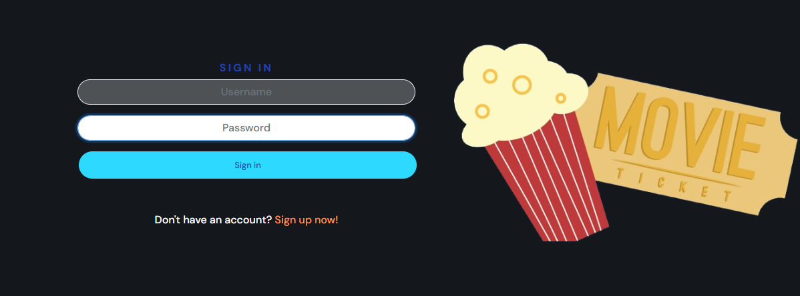

# Reeltalk project

**Advanced Front-End Portfolio Project(PP5) - Code Institute**

View the deployed site [here](https://reeltalk-project-74cd4a21e230.herokuapp.com/) 

The goal of this project is to create a vibrant online platform where movie enthusiasts can connect and discover new movies and share their opinions on their favorite movies By sharing and exploring these posts, users can easily find new and exciting movies and discuss their opinions.As an avid movie enthusiast I would love the idea of an open and friendly community where users can freely discuss their opinions and share their opinions on their favorite momvies.

The Reeltalk frontend is the user interface component of the Reeltalk application, designed with React to provide an engaging and intuitive experience for users interacting with the social network. It connects with the [Reeltalk Backend API](https://reeltalk-api-a79479495f97.herokuapp.com), enhancing user experience by offering a responsive and dynamic interface.

 

#### Note
Due to severe time constraints much of this project has been left unfinished. Development on Reeltalk will resume after submission
## Table of contents

- [User Experience](#user-experience)
  - [ User stories](#epics-and-user-stories)
- [Design](#design)
  - [Wireframes](#wireframes)
  - [Logo](#logo)
  - [Typography](#typography)
- [Structure](#structure)
- [Features](#features)
- [Reusable Components](#reusable-components)
- [Bugs](#bugs)
- [Technologies Used](#technologies-used)
  - [Languages](#languages)
  - [Tools](#tools)
  - [Frameworks](#frameworks)
  - [Libraries and modules](#libraries-and-modules)
- [Testing](#testing)
  - [Manual testing](#manual-testing)
  - [Browser Compatibility](#browser-compatibility)
- [Deployment](#deployment)
  - [Heroku](#heroku)
  - [Local deployment](#local-deployment)
  - [Forking this GitHub repository](#forking-this-github-repository)
  - [Clone this repository](#clone-this-repository)
- [Credits](#credits)
  - [Content](#content)
  - [Code](#code)
  - [ReadMe](#readme)
  - [Acknowledgments](#acknowledgments)

## User Experience

I used an Agile methodology approach to plan this project. This was implemented through the GitHub Project board with user stories and tasks. Given the limited time frame, I've prioritized creating a broad overview of the project's features through high-level user stories. In a collaborative environment, I would delve into more granular user stories to ensure a comprehensive understanding of the requirements.

### User stories

*Reeltalk* is designed for active individuals who love to connect and explore new movies. The platform offers the posibility for users to make posts about their favorite movies sharing positives, negatives and general opnions and helps other user to get to know the information and likewise share with others. While it’s open to everyone, the primary focus is on those who have a deep passion for movies and would like to share their love with other movie enthusiasts. Reeltalk helps users connect with like-minded people and enrich their knowledge base. 
Each user story was classified with a label according to MoSCoW prioritization. 
The Kanban board can be seen [here](https://github.com/users/rasm1/projects/4).

## Design

### Wireframes

Due to lack of time, some of the originally planned features had to be deleted or implemented differently, set aside for later development.

#### Colour Scheme:

The color palette was created based on the neon colors of the logo text with [ColorSpace](https://mycolor.space/?hex=%23FF3131&sub=1). The navbar has the gradient pastel colours.

The (hex) color pallets for this project include:
-  #fff
- #212529

 

### Typography

I have used "DM Sans", sans-serif font through out the project.

## Structure

All information about the structure can be found in the README of the API [here](https://github.com/rasm1/Reeltalk-api)

## Features

### Existing Features

logo and navbar 

 

To ensure uniformity and a sense of familiarity for users, all pages include the same header with navigation links depending on the authentication status of the user. 
The header consists of the logo, which is always arranged on the left and acts as a link to return to the main page. On the right side is the navigation bar, which turns into a clickable burger menu on smaller screens. Depending on whether the user is logged in or not, the navigation elements adapt accordingly. 
 

**For Logged-Out Users:** 
- *Home*: Redirects to the home page, displaying an overview of all active Groovemates posts from latest to old.  
- *Sign Up*: Takes the user to the registration page to create an account and begin interacting with the site.  
- *Log In*: Directs to the login page for returning users to access their accounts. 

**For Logged-In Users:**  
- *Home*: Same as the logged-out view, showing all active Posts.
- *Addpost*: Directs to the page where the user can create a new Post.
- *Feed*: Shows all posts of users who has been followed by the currentuser.
- *Liked*: Displays all the posts which was liked by the user.
- *Avatar/Profile*: It displays the number of followers, following, number of post uploaded by currentuser, on sidebar can view the shared post of only the current user.
- *Sign Out*: Allows the user to securely log out of their account.

 

View for users who are not logged in: 
  - Screenshot of navbar in mobile view: 
   
  - Screenshot of navbar on larger screens: 
   

  View for users who are logged in: 
  - Screenshot of navbar in desktop view: 
   
 

 logo & Title

 

The name is a play on words transforming the word 'realtalk' to imply that the application is used for deep discussions about movies 
Screenshot of the logo: 
 

 User authentication 

 

The user authentication system is implemented using the [dj-rest-auth](https://dj-rest-auth.readthedocs.io/en/latest/) framework, ensuring secure and reliable access to the site. This feature includes standard registration, login, and logout processes, with error handling and feedback tailored to match the application's design.  

**Sign Up** 
Users who are new to the site or have not yet created an account, can select the "Sign up" option from the Navigation Bar to register for a new user account. This process utilizes the standard dj-rest/auth/registration method for user account creation. After properly registering, the user will be redirected to the login page.  
Screenshot for Sign Up:  
 
Screenshot for Sign Up with Error message for username:  
 
Screenshot for Sign Up with Error message for password:  
 

**Sign in**  
Users who already have an account can click on the "Signin" option in the Navigation Bar to access their account. This page utilizes the standard dj-rest/auth/login method for user authentication. After the user correctly logs in, the user is redirected to the homepage, where an overview of all created Posts is shown. 
Screenshot for Log In:  
 
Screenshot for Log In with error message:  
 

 

 User Profile 

 

The user can access their profile only if logged-in through the navigation bar, from the "Most Popular Profiles" section (if they are listed there), or can say by clicking on the profile picture it will take you to profile page.  

The profile contains the following components: 
**Profile Picture**: If the user hasn’t uploaded a picture, a placeholder image of default avatar icon will appear throughout the site is shown. 
**Username**: The username that the user created during the signup process. 
**Follow/Unfollow button**: This button appears only if the user being viewed is not the currently logged-in user. 
**Overview of Posts**: Displays the number of Posts the user has currently created. 
**Followers and Following Counts**: Shows how many people are following the user and how many people the user is following. 
**"Bio" Description**: A personal description if the user has filled it out. 

>
**Edit a profile** 
Screenshot of profile dropdown:

 Post Management

 
Post Management includes the following topics: 

**Adding a new Post**: Users can create and submit new Posts through a designated form.
**Post Detail View**: Users can view detailed information about a specific Post by clicking on the title or the image in the Post card. 
**Editing or deleting an existing Post**: Users can modify or remove their existing Posts through an edit or delete option. 
**Overview of all existing Posts on Homepage**: The home page displays a comprehensive list of all available Posts. 
**Overview of Posts created by the user on their profile page**: Users can view a summary of all Posts they have created from their profile page. 
**Overview of liked Posts**: Users can access a list of Posts they have liked for quick reference. 
**Overview of Posts whom user following in Feed**: Users can view a list of Posts of the user who are being followed.   

 - **Adding a new Post** 
To add a Post, the user must sign up and log in. They can then navigate to the appropriate page via the navigation bar.
After the user clicks the 'Create' button and all required fields are correctly filled, they will be redirected to the detail page of this Post.  

Screenshot of 'add a Post' page: 
 

- **Post detail view** 
A Post contains several elements in its detailed view. The following elements are included for the owner of the Post: 
  - *Title*: The title of the post.  
  - *Image*: The image associated with the Post or the placeholder image  
  - *Content*: A textfield where the content is displayed  
  - *Last Updated*: Information on when the Post was last updated.  
  - *moviepositives*: A textfield where users can list positives about the movie  
  - *movie negatives*: A textfield where users can list negatives about the movie  
  - *spoilers*: a boolean field where the post creator can warn other about spoilers contained in the post  

- **Edit a Post** 
As part of the full CRUD functionality, the Post owner has the ability to edit the Post. When a user clicks the link to edit their Post, they are redirected to a form page where the existing data is already populated in the corresponding fields. The form retains the same validations as the "Create a Post" form, including image size limits (maximum 2 MB). After the user clicks the "save" button, they are redirected to the Post's detail page where you can see the update post. 

- **Delete a Post** 
As part of the full CRUD functionality, the Post owner can delete a Post. This can be achieved from the Post overview by clicking on the dropdown icon as well as from the detail page of the Post. After successful deletion, the user is redirected back to the homepage and the corresponding Post is deleted from the database and the overview. 

- **Displaying an overview of all existing Posts on the Homepage.** 
The user can access the overview page of all Posts that have been created by clicking on the homepage. The user can access the overview page displaying all created Posts by clicking on the "Home" link in the navigation bar or by clicking on the logo. This page presents Posts sorted by the date they were added, with the most recent ones appearing first. Each Post is displayed in a card format that includes essential details such as the description, date, time and counts of likes, comments. The overview page features infinite scroll functionality: when the user scrolls through 10 Posts, the next set of Posts is automatically loaded. During this process, a spinner is briefly displayed to indicate that more content is being loaded. 
In mobile view, the most active profiles are displayed above the Posts, while in desktop view, they are displayed alongside the Posts.
  

- **Displaying an overview of liked Posts** 
When a user likes a Post by clicking on the heart icon within the Post card, they can later access an overview page of all their liked Posts. This page can be reached through the navigation bar by clicking on *liked*. The liked Posts are displayed similarly to those on the homepage overview, with each Post presented in a card format. This includes the description,counts of likes,  comments.  

- **Displaying an Overview of Posts from followed Users**  
As a user, you can view an overview of all Posts created by the users you follow. This page can be reached through the navigation bar by clicking the link  *Feed* in the Navbar. This page showcases Posts created by the followed users, presented in a card format similar to the homepage overview. Each card includes essential details such as description, likes, comments.

- **Displaying an overview of all Posts created by user** 
As already explained in the profile feature, all Posts created by the user are listed on their profile.

**Comment Section:**
Users can interact with the Post by adding comments:  

The user's profile image is displayed next to the comment form field. After entering a comment and clicking the "post" button, the comment is displayed under the Post in a list format. Each comment includes the commenter's profile image, the time when the comment was added, and the comment content.
If the currently logged-in user is the owner of the comment, dropdown icon appear next to the comment, providing options to edit or delete the comment.  
- *Edit*: When the user clicks "Edit" on their comment, the comment form reopens with the existing content. The user can then update the comment and save the changes. Alternatively, they can cancel the edit, which will close the form, leaving the comment unchanged.  
- *Delete*: When the user clicks "Delete" on their comment. Upon confirming the deletion, the comment is removed from the list.

### Features, which I would like to implement in the future

- *Delete a Profile*: Allow users to permanently delete their profiles from the platform. This feature will include necessary confirmations and safeguards to prevent accidental deletions. 
- *movie trailer*: Allows users to link a movie trailer in their posts.
- *Confirmation messages*: success messages for all the functionality like delete, updated etc
- *Custom Css*: Custom CSS that appeals to the eye
- *Error handling*: Error handling for an improved user experience
- *enhanced spoiler warning*: Enhanced spoiler warning that covers spoiler text

## Reusable Components

Reusable components are a core principle in React, enabling developers to write modular, maintainable, and efficient code. Examples of reusable components in this project: 

**Assets.js** 
 This component is designed to handle the display of a loading spinner, an image, or a message, depending on the props passed to it.  
It was utilized in various parts of the application. Here's how it was employed across different components:
- PostCreateForm: To display a placeholder image encouraging the user to upload one, accompanied by a message.
- PostPage: To load the spinner while the Post content is being retrieved.
- PostsPage: To load the spinner during data retrieval and display a placeholder image with a corresponding message when no Posts could be found.
- PopularProfiles: To display a spinner while the user profiles are being loaded.
- ProfilePage: To load the spinner during profile retrieval and to display a placeholder image if the user hasn't created any Posts yet.

 

**MoreDropdown.js** 
The MoreDropdown component is designed to provide users with quick access to editing or deleting content within the application. This component utilizes Bootstrap's Dropdown.  
The *ProfilePage, Comment, Post* extends the functionality of the *MoreDropdown* by offering component-specific actions. This component provides options to edit/Delete option in various components like ProfilePage/Post/Comments, for example in ProfilePage user can change the username, or update the password. Each option redirects the user to the appropriate editing page, leveraging React Router's useNavigate hook for seamless navigation.  
The MoreDropdown component enhances user experience by providing a consistent and intuitive way to manage content and profiles within the application, making it easy to access essential editing and deletion functionalities while ensuring that any critical actions are thoroughly confirmed before being executed. 

**NavBar.js** 
The Navbar component played a central role in the application's navigation, offering a consistent and intuitive user experience across the site. It was designed to adapt dynamically based on the user's authentication status, providing access to relevant features and pages. 

**NotFound.js** 
The NotFound component is a specialized component designed to handle 404 errors, providing users with a clear indication that the page they are trying to access does not exist.

## Known Bugs
- lack of infinite scrolling in liked and comment lists
- post images not loading
- avatar images not loading
- comments not able to be posted
- data fields not prepopulated in edit post page

## Technologies Used

### Languages:
- [CSS](https://en.wikipedia.org/wiki/CSS)
- [JavaScript](https://www.javascript.com/)
- [JSX](https://de.legacy.reactjs.org/docs/introducing-jsx.html)

### Tools:
- [Git](https://git-scm.com/) was used for version control by utilizing the Gitpod terminal to commit to Git and Push to GitHub.
- [GitHub](https://github.com/) was used to save and store the files for the website.
- [Heroku](https://www.heroku.com) was used to deploy the application.
- [Code Insitute Database Maker](https://dbs.ci-dbs.net/) PostgreSQL database hosting for this project
- [Fontawesome](https://fontawesome.com/) was used to add icons to the website.
- [tinypng](https://tinypng.com/) was used to reduce the image sizes.
- [Pixabay](https://www.pixabay.com/de-de/) was used to search and load images
- [Cloudinary](https://cloudinary.com/) was used to store the images for Posts and profiles.
- [Google Chrome Dev Tools](https://developer.chrome.com/docs/devtools?hl=de) were used to check the application for responsiveness and errors.

### Frameworks: 
- [React](https://react.dev/)
- [React Bootstrap](https://react-bootstrap.netlify.app/)
- [React Router Dom](https://reactrouter.com/en/main)

### Libraries and modules:
- [Axios](https://axios-http.com/docs/intro)
- [React Infinite Scroll Component](https://www.npmjs.com/package/react-infinite-scroll-component)
- [Moment](https://momentjs.com/)

## Testing

The app was tested regularly and deployed early to Heroku to make sure both local and remote worked the same.

### Manual Testing

 Click here to see the testing table for features

 

| Page          | User Action   | Expected Result  | Notes            |
|---------------|---------------|------------------|------------------|
| Home Page     |               |                  |                  |
|               | Click on Logo | Redirect to Home Page | PASS        |
|               | Click on signup button (Navigation bar) | Redirect to Sign Up page | PASS |
|               | Click on signin (Navigation bar) | Move to signin page | PASS |
|               | Click on post title | Redirect to post detail | PASS |
| Home Page (Logged In - User)  |                 |          |  |
|               | After Login | signin button replaced with feed & likes | PASS |
|               | Click on add posts | Redirect to create posts | PASS |
|               | Click on logo | Redirects to homepage | PASS |
|               | Click on burger icon | Open dropdown menu | PASS |
|               | Click on sign out  | Redirect to Logout Page | PASS |
| Register Page  |                  |                  |                  |
|               | no username | warning displayed prompting to enter username | PASS |
|               | Type invalid password | Must contain atleast 8 char | PASS |
|               | Type valid password | No error | PASS |
|               | Type password again (different) | Password must be the same | PASS |
|               | Fill all the form fields | Account created | PASS |
| Login Page  |                  |                  |                  |
|               | Try invalid username | Username is not correct | PASS |
|               | Try invalid password | Password is not correct | PASS |
|               | Valid password and username | Logs in | PASS |
|               | Click Sign In with empty form | Fill in the form fields | PASS |
| Logout Page  |                  |                  |                  |
|               | Click on Signout button | Sign user out, message that user signed out | PASS |

### Browser Compatibility
  The tests were conducted using the following browser:

- Google Chrome Version 127  
- Edge 127
- Opera 112
- Brave 1.68

## Deployment

### Heroku
This site is deployed using Heroku. To deploy it from its GitHub repository to Heroku, I took the following steps:

1. Log in (or sign up) to Heroku
2. Click on the _New_ button and select _Create new app_
3. Give it a unique name and choose the region _Europe_
4. Click the *Deploy* tab, go to the _Deployment method_ section, select _GitHub_ and confirm this selection by clicking on the _Connect to Github_ button
5. Search for the repository name on github Reeltalk and click the _Connect_ button
6. Inside the src folder add an api folder and create an axiosDefault.jsx
7. Add the link to the deployed version of the api as baseURL
8. Create a _Procfile_ in the root directory and add *web: npm run start*
9. In Heroku enable the automatic deploy or manually deploy the code from the main branch

To see the [view of the live site NOG TE IMPLEMENTEREN](https://groovemates-frontend-b3335269700f.herokuapp.com/) click on the _Open app_ button in the top right corner or, if you enabled automatic deploy (step 10), log in to GitHub, navigate to the repository for this project by selecting [Reeltalk](https://github.com/rasm1/Reeltalk), click on _Deployment_ and choose in the _Environments_ section  Reeltalk.  

### Forking this GitHub repository
1.  Log in to GitHub.
2.  Navigate to the repository for this project by selecting [*Reeltalk*](https://github.com/rasm1/Reeltalk)
3.  Click at the top of the repository on the **Fork** button on the right side

### Clone this repository
1. Log in to GitHub.
2. Navigate to the repository for this project by selecting [*Reeltalk*](https://github.com/rasm1/Reeltalk)
3. In the top-right corner, click on the green *Code* button
4. Copy the HTTPS URL in the tab *Local*
5. Go to the code editor of your choice and open the terminal
5. Type `git clone` and paste the URL you copied into your terminal
6. Press the enter key

## Credits

### Code

- Parts of the setup and overall design of this project were guided by the Code Institute's Moments walkthrough project. The core elements of the Profile, Post, Follower, liked, Feed, and Comment components, were derived from the walkthrough project and subsequently tailored to meet the unique requirements of this project.
- Token authentication code was inspired by [Liene Breide]https://github.com/lienebriede/habit-react/

- The following websites were used as a source of knowledge:  
  - [Google](www.google.com)
  - [Stack Overflow](https://stackoverflow.com/)
  - [reddit](https://www.reddit.com/)
  - Documentation for React, react-bootstrap, dj-rest-auth, Django, react-router-dom
  - Slack Community
- For troubleshooting, [Google](www.google.com),

### ReadMe

 a big thank you to [Pramila shanmugam](https://github.com/Pramilashanmugam/GrooveMates_backend), her README server as an inspiration and as an example.

### Acknowledgments

- I would like to thank my wonderful Mitko Bacharov for his numerous tips and great assistance during the creation of this project.  
- I would like to give a shoutout to the wonderful tutor team especially, Oisin, Thomas and Rebecca who helped me numerous times when I was stuck and struggling to achieve the results I was aiming for. Your support and guidance have been amazing. Thank you!

**This is for educational use.**